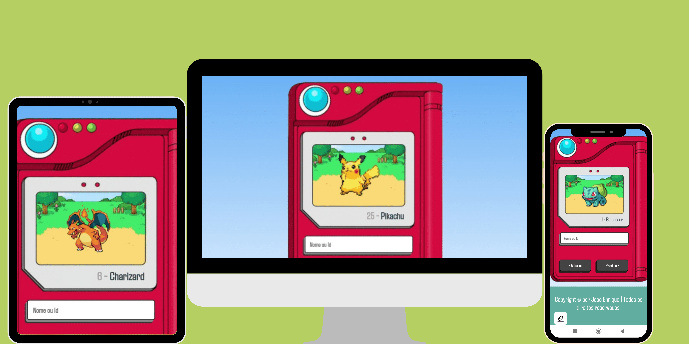

<h1 align="center">Pokédex - João 👾</h1>

<h4 align="center"><a href="https://jedev1.github.io/Pokedex/">Confira o projeto aqui</a></h4>

---

## 💻 Sobre

Projeto feito no intuito de mostrar minhas habilidades.(projeto está no meu portifólio confira)
<h4 align="center"><a href="https://jedev1.github.io/Meu-portifolio">Confira o projeto aqui</a></h4>

## 🧠 Tecnologias utilizadas:

As tecnologias que utilizei foram:

    
    
    

## 📚 Alguns conceitos aplicados

Neste projeto apliquei os seguintes pontos:
+ HTML;
+ CSS;
+ Pontos de acessibilidade;
+ Responsividade;
+ Mobile first;
+ Utilização do JS
+ Utilização de API

---

## 😎 Licença

The [MIT License](./LICENSE).
